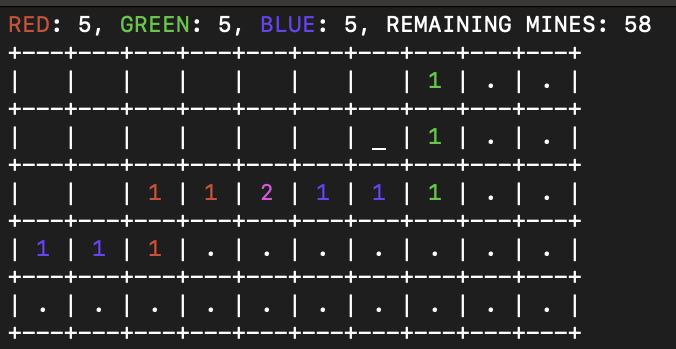

# pallet-minesweeper

## Overview

  

- A CLI-based Minesweeper game featuring red, blue, and green mines.
- The number on a revealed tile is displayed in a color that represents the mixed colors of the surrounding 8 tiles' mines.
    - Ex) A tile with a red mine on the left and a blue mine on the right will show the number "2" in magenta.

## Key Controls
- **W/A/S/D**: Move the cursor.  
- **I/O/P**: Place a red/green/blue flag.  
- **Space**: Open a tile.  
- **C**: Quit the game.  

## Victory Conditions
- Uncover all safe tiles.  
- Correctly flag all mines with their respective colors (red, green, or blue).  
- Avoid stepping on any mine.

## Requirement
This project requires C++14 or later.